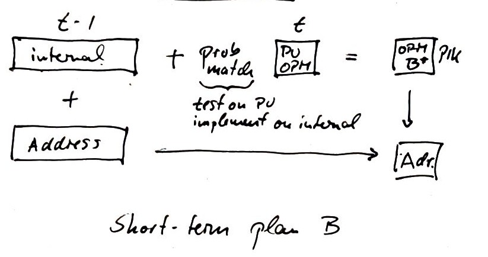

# Situation

For a variety of reasons, the DUA (Data Use Agreement) between OPM and the Census Bureau has not been finalized for a signficant time. This puts at risk dependent data products (QWI, J2J, LODES). The present document outlines a fallback strategy which may allow for such dependent products to continue to be produced, albeit with some quality reductions. It is expected that quality compromises are minimal in the short-run, but would continue to increase over time. We address some workarounds at the end of this document.

# Naming convention


  + OPM(Census) – OPM microdata acquired through DUA (last year of data: 2015)
  + OPM(FOIA[x]) – OPM microdata acquired through FOIA request to OPM (x = Cornell1, Cornell2, Buzzfeed). Time coverage varies
  + OPM(PU) – OPM microdata publicly available at Fedscope.gov
  + ECF(A) – ECF built with dataset A

# Availability of Data

> TODO:  This still needs the data elements on the internal data

The various data sources do not all have the same data elements:


```r
overview <- read_excel("overview.xlsx") %>% select("Variable","Buzzfeed","Cornell-FOIA 2013","Cornell FOIA 2016", "Fedscope-old","Fedscope-new" )
```

```
## New names:
## * `` -> `..9`
## * `` -> `..10`
```

```r
kable(overview %>% slice(1:10)) %>%
	kable_styling(bootstrap_options = c("striped", "hover", "condensed"), full_width = F)
```

<table class="table table-striped table-hover table-condensed" style="width: auto !important; margin-left: auto; margin-right: auto;">
 <thead>
  <tr>
   <th style="text-align:left;"> Variable </th>
   <th style="text-align:right;"> Buzzfeed </th>
   <th style="text-align:right;"> Cornell-FOIA 2013 </th>
   <th style="text-align:right;"> Cornell FOIA 2016 </th>
   <th style="text-align:right;"> Fedscope-old </th>
   <th style="text-align:right;"> Fedscope-new </th>
  </tr>
 </thead>
<tbody>
  <tr>
   <td style="text-align:left;"> Employee Name </td>
   <td style="text-align:right;"> 1 </td>
   <td style="text-align:right;"> 0 </td>
   <td style="text-align:right;"> 0 </td>
   <td style="text-align:right;"> 0 </td>
   <td style="text-align:right;"> 0 </td>
  </tr>
  <tr>
   <td style="text-align:left;"> Pseudo ID </td>
   <td style="text-align:right;"> 1 </td>
   <td style="text-align:right;"> 2 </td>
   <td style="text-align:right;"> 3 </td>
   <td style="text-align:right;"> 0 </td>
   <td style="text-align:right;"> 0 </td>
  </tr>
  <tr>
   <td style="text-align:left;"> Agency/Subelement </td>
   <td style="text-align:right;"> 1 </td>
   <td style="text-align:right;"> 1 </td>
   <td style="text-align:right;"> 1 </td>
   <td style="text-align:right;"> 1 </td>
   <td style="text-align:right;"> 1 </td>
  </tr>
  <tr>
   <td style="text-align:left;"> Duty Station </td>
   <td style="text-align:right;"> 1 </td>
   <td style="text-align:right;"> 1 </td>
   <td style="text-align:right;"> 1 </td>
   <td style="text-align:right;"> 0 </td>
   <td style="text-align:right;"> 0 </td>
  </tr>
  <tr>
   <td style="text-align:left;"> Location (State/Country) </td>
   <td style="text-align:right;"> 0 </td>
   <td style="text-align:right;"> 0 </td>
   <td style="text-align:right;"> 0 </td>
   <td style="text-align:right;"> 1 </td>
   <td style="text-align:right;"> 1 </td>
  </tr>
  <tr>
   <td style="text-align:left;"> Age Level </td>
   <td style="text-align:right;"> 1 </td>
   <td style="text-align:right;"> 1 </td>
   <td style="text-align:right;"> 1 </td>
   <td style="text-align:right;"> 1 </td>
   <td style="text-align:right;"> 1 </td>
  </tr>
  <tr>
   <td style="text-align:left;"> Sex </td>
   <td style="text-align:right;"> 0 </td>
   <td style="text-align:right;"> 1 </td>
   <td style="text-align:right;"> 0 </td>
   <td style="text-align:right;"> 0 </td>
   <td style="text-align:right;"> 1 </td>
  </tr>
  <tr>
   <td style="text-align:left;"> Ethnicity </td>
   <td style="text-align:right;"> 0 </td>
   <td style="text-align:right;"> 0 </td>
   <td style="text-align:right;"> 0 </td>
   <td style="text-align:right;"> 1 </td>
   <td style="text-align:right;"> 1 </td>
  </tr>
  <tr>
   <td style="text-align:left;"> Race </td>
   <td style="text-align:right;"> 0 </td>
   <td style="text-align:right;"> 0 </td>
   <td style="text-align:right;"> 0 </td>
   <td style="text-align:right;"> 1 </td>
   <td style="text-align:right;"> 1 </td>
  </tr>
  <tr>
   <td style="text-align:left;"> GS-Equivalent Grade </td>
   <td style="text-align:right;"> 0 </td>
   <td style="text-align:right;"> 1 </td>
   <td style="text-align:right;"> 0 </td>
   <td style="text-align:right;"> 1 </td>
   <td style="text-align:right;"> 1 </td>
  </tr>
</tbody>
</table>
(with another 28 rows not shown)


In particular, 12 variables are common to all public datasets, but key variables are present only on one or two datasets:
<table class="table table-striped table-hover table-condensed" style="width: auto !important; margin-left: auto; margin-right: auto;">
 <thead>
  <tr>
   <th style="text-align:left;"> Variable </th>
   <th style="text-align:left;"> Buzzfeed </th>
   <th style="text-align:left;"> Cornell-FOIA 2013 </th>
   <th style="text-align:left;"> Cornell FOIA 2016 </th>
   <th style="text-align:left;"> Fedscope-old </th>
   <th style="text-align:left;"> Fedscope-new </th>
   <th style="text-align:left;"> common </th>
  </tr>
 </thead>
<tbody>
  <tr>
   <td style="text-align:left;"> Duty Station </td>
   <td style="text-align:left;"> <span style=" font-weight: bold;    ">1</span> </td>
   <td style="text-align:left;"> <span style=" font-weight: bold;    ">1</span> </td>
   <td style="text-align:left;"> <span style=" font-weight: bold;    ">1</span> </td>
   <td style="text-align:left;"> <span style="     ">0</span> </td>
   <td style="text-align:left;"> <span style="     ">0</span> </td>
   <td style="text-align:left;"> <span style=" font-weight: bold;    ">3</span> </td>
  </tr>
  <tr>
   <td style="text-align:left;"> Location (State/Country) </td>
   <td style="text-align:left;"> <span style="     ">0</span> </td>
   <td style="text-align:left;"> <span style="     ">0</span> </td>
   <td style="text-align:left;"> <span style="     ">0</span> </td>
   <td style="text-align:left;"> <span style=" font-weight: bold;    ">1</span> </td>
   <td style="text-align:left;"> <span style=" font-weight: bold;    ">1</span> </td>
   <td style="text-align:left;"> <span style=" font-weight: bold;    ">2</span> </td>
  </tr>
  <tr>
   <td style="text-align:left;"> Sex </td>
   <td style="text-align:left;"> <span style="     ">0</span> </td>
   <td style="text-align:left;"> <span style=" font-weight: bold;    ">1</span> </td>
   <td style="text-align:left;"> <span style="     ">0</span> </td>
   <td style="text-align:left;"> <span style="     ">0</span> </td>
   <td style="text-align:left;"> <span style=" font-weight: bold;    ">1</span> </td>
   <td style="text-align:left;"> <span style=" font-weight: bold;    ">2</span> </td>
  </tr>
  <tr>
   <td style="text-align:left;"> Ethnicity </td>
   <td style="text-align:left;"> <span style="     ">0</span> </td>
   <td style="text-align:left;"> <span style="     ">0</span> </td>
   <td style="text-align:left;"> <span style="     ">0</span> </td>
   <td style="text-align:left;"> <span style=" font-weight: bold;    ">1</span> </td>
   <td style="text-align:left;"> <span style=" font-weight: bold;    ">1</span> </td>
   <td style="text-align:left;"> <span style=" font-weight: bold;    ">2</span> </td>
  </tr>
  <tr>
   <td style="text-align:left;"> Race </td>
   <td style="text-align:left;"> <span style="     ">0</span> </td>
   <td style="text-align:left;"> <span style="     ">0</span> </td>
   <td style="text-align:left;"> <span style="     ">0</span> </td>
   <td style="text-align:left;"> <span style=" font-weight: bold;    ">1</span> </td>
   <td style="text-align:left;"> <span style=" font-weight: bold;    ">1</span> </td>
   <td style="text-align:left;"> <span style=" font-weight: bold;    ">2</span> </td>
  </tr>
  <tr>
   <td style="text-align:left;"> GS-Equivalent Grade </td>
   <td style="text-align:left;"> <span style="     ">0</span> </td>
   <td style="text-align:left;"> <span style=" font-weight: bold;    ">1</span> </td>
   <td style="text-align:left;"> <span style="     ">0</span> </td>
   <td style="text-align:left;"> <span style=" font-weight: bold;    ">1</span> </td>
   <td style="text-align:left;"> <span style=" font-weight: bold;    ">1</span> </td>
   <td style="text-align:left;"> <span style=" font-weight: bold;    ">3</span> </td>
  </tr>
  <tr>
   <td style="text-align:left;"> Length of Service </td>
   <td style="text-align:left;"> <span style="     ">0</span> </td>
   <td style="text-align:left;"> <span style=" font-weight: bold;    ">1</span> </td>
   <td style="text-align:left;"> <span style=" font-weight: bold;    ">1</span> </td>
   <td style="text-align:left;"> <span style=" font-weight: bold;    ">1</span> </td>
   <td style="text-align:left;"> <span style=" font-weight: bold;    ">1</span> </td>
   <td style="text-align:left;"> <span style=" font-weight: bold;    ">4</span> </td>
  </tr>
  <tr>
   <td style="text-align:left;"> Average Salary </td>
   <td style="text-align:left;"> <span style="     ">0</span> </td>
   <td style="text-align:left;"> <span style="     ">0</span> </td>
   <td style="text-align:left;"> <span style="     ">0</span> </td>
   <td style="text-align:left;"> <span style=" font-weight: bold;    ">1</span> </td>
   <td style="text-align:left;"> <span style=" font-weight: bold;    ">1</span> </td>
   <td style="text-align:left;"> <span style=" font-weight: bold;    ">2</span> </td>
  </tr>
  <tr>
   <td style="text-align:left;"> Average Length of Service </td>
   <td style="text-align:left;"> <span style="     ">0</span> </td>
   <td style="text-align:left;"> <span style="     ">0</span> </td>
   <td style="text-align:left;"> <span style="     ">0</span> </td>
   <td style="text-align:left;"> <span style=" font-weight: bold;    ">1</span> </td>
   <td style="text-align:left;"> <span style=" font-weight: bold;    ">1</span> </td>
   <td style="text-align:left;"> <span style=" font-weight: bold;    ">2</span> </td>
  </tr>
  <tr>
   <td style="text-align:left;"> Employment </td>
   <td style="text-align:left;"> <span style="     ">0</span> </td>
   <td style="text-align:left;"> <span style="     ">0</span> </td>
   <td style="text-align:left;"> <span style="     ">0</span> </td>
   <td style="text-align:left;"> <span style=" font-weight: bold;    ">1</span> </td>
   <td style="text-align:left;"> <span style=" font-weight: bold;    ">1</span> </td>
   <td style="text-align:left;"> <span style=" font-weight: bold;    ">2</span> </td>
  </tr>
  <tr>
   <td style="text-align:left;"> Supervisory Status </td>
   <td style="text-align:left;"> <span style=" font-weight: bold;    ">1</span> </td>
   <td style="text-align:left;"> <span style="     ">0</span> </td>
   <td style="text-align:left;"> <span style="     ">0</span> </td>
   <td style="text-align:left;"> <span style=" font-weight: bold;    ">1</span> </td>
   <td style="text-align:left;"> <span style=" font-weight: bold;    ">1</span> </td>
   <td style="text-align:left;"> <span style=" font-weight: bold;    ">3</span> </td>
  </tr>
  <tr>
   <td style="text-align:left;"> Work Status </td>
   <td style="text-align:left;"> <span style="     ">0</span> </td>
   <td style="text-align:left;"> <span style="     ">0</span> </td>
   <td style="text-align:left;"> <span style="     ">0</span> </td>
   <td style="text-align:left;"> <span style=" font-weight: bold;    ">1</span> </td>
   <td style="text-align:left;"> <span style=" font-weight: bold;    ">1</span> </td>
   <td style="text-align:left;"> <span style=" font-weight: bold;    ">2</span> </td>
  </tr>
  <tr>
   <td style="text-align:left;"> CBSA </td>
   <td style="text-align:left;"> <span style="     ">0</span> </td>
   <td style="text-align:left;"> <span style=" font-weight: bold;    ">1</span> </td>
   <td style="text-align:left;"> <span style=" font-weight: bold;    ">1</span> </td>
   <td style="text-align:left;"> <span style="     ">0</span> </td>
   <td style="text-align:left;"> <span style="     ">0</span> </td>
   <td style="text-align:left;"> <span style=" font-weight: bold;    ">2</span> </td>
  </tr>
  <tr>
   <td style="text-align:left;"> MSA-RETRO </td>
   <td style="text-align:left;"> <span style="     ">0</span> </td>
   <td style="text-align:left;"> <span style=" font-weight: bold;    ">1</span> </td>
   <td style="text-align:left;"> <span style="     ">0</span> </td>
   <td style="text-align:left;"> <span style=" font-weight: bold;    ">1</span> </td>
   <td style="text-align:left;"> <span style=" font-weight: bold;    ">1</span> </td>
   <td style="text-align:left;"> <span style=" font-weight: bold;    ">3</span> </td>
  </tr>
  <tr>
   <td style="text-align:left;"> STEM Occupation </td>
   <td style="text-align:left;"> <span style="     ">0</span> </td>
   <td style="text-align:left;"> <span style="     ">0</span> </td>
   <td style="text-align:left;"> <span style="     ">0</span> </td>
   <td style="text-align:left;"> <span style=" font-weight: bold;    ">1</span> </td>
   <td style="text-align:left;"> <span style=" font-weight: bold;    ">1</span> </td>
   <td style="text-align:left;"> <span style=" font-weight: bold;    ">2</span> </td>
  </tr>
  <tr>
   <td style="text-align:left;"> File Date </td>
   <td style="text-align:left;"> <span style="     ">0</span> </td>
   <td style="text-align:left;"> <span style=" font-weight: bold;    ">1</span> </td>
   <td style="text-align:left;"> <span style=" font-weight: bold;    ">1</span> </td>
   <td style="text-align:left;"> <span style="     ">0</span> </td>
   <td style="text-align:left;"> <span style="     ">0</span> </td>
   <td style="text-align:left;"> <span style=" font-weight: bold;    ">2</span> </td>
  </tr>
  <tr>
   <td style="text-align:left;"> Start Date </td>
   <td style="text-align:left;"> <span style="     ">0</span> </td>
   <td style="text-align:left;"> <span style=" font-weight: bold;    ">1</span> </td>
   <td style="text-align:left;"> <span style=" font-weight: bold;    ">1</span> </td>
   <td style="text-align:left;"> <span style="     ">0</span> </td>
   <td style="text-align:left;"> <span style="     ">0</span> </td>
   <td style="text-align:left;"> <span style=" font-weight: bold;    ">2</span> </td>
  </tr>
  <tr>
   <td style="text-align:left;"> End Date </td>
   <td style="text-align:left;"> <span style="     ">0</span> </td>
   <td style="text-align:left;"> <span style=" font-weight: bold;    ">1</span> </td>
   <td style="text-align:left;"> <span style=" font-weight: bold;    ">1</span> </td>
   <td style="text-align:left;"> <span style="     ">0</span> </td>
   <td style="text-align:left;"> <span style="     ">0</span> </td>
   <td style="text-align:left;"> <span style=" font-weight: bold;    ">2</span> </td>
  </tr>
  <tr>
   <td style="text-align:left;"> Accession </td>
   <td style="text-align:left;"> <span style=" font-weight: bold;    ">1</span> </td>
   <td style="text-align:left;"> <span style="     ">0</span> </td>
   <td style="text-align:left;"> <span style="     ">0</span> </td>
   <td style="text-align:left;"> <span style=" font-weight: bold;    ">1</span> </td>
   <td style="text-align:left;"> <span style=" font-weight: bold;    ">1</span> </td>
   <td style="text-align:left;"> <span style=" font-weight: bold;    ">3</span> </td>
  </tr>
  <tr>
   <td style="text-align:left;"> Effective Date of Accession </td>
   <td style="text-align:left;"> <span style=" font-weight: bold;    ">1</span> </td>
   <td style="text-align:left;"> <span style="     ">0</span> </td>
   <td style="text-align:left;"> <span style="     ">0</span> </td>
   <td style="text-align:left;"> <span style=" font-weight: bold;    ">1</span> </td>
   <td style="text-align:left;"> <span style=" font-weight: bold;    ">1</span> </td>
   <td style="text-align:left;"> <span style=" font-weight: bold;    ">3</span> </td>
  </tr>
  <tr>
   <td style="text-align:left;"> Separation </td>
   <td style="text-align:left;"> <span style=" font-weight: bold;    ">1</span> </td>
   <td style="text-align:left;"> <span style="     ">0</span> </td>
   <td style="text-align:left;"> <span style="     ">0</span> </td>
   <td style="text-align:left;"> <span style=" font-weight: bold;    ">1</span> </td>
   <td style="text-align:left;"> <span style=" font-weight: bold;    ">1</span> </td>
   <td style="text-align:left;"> <span style=" font-weight: bold;    ">3</span> </td>
  </tr>
  <tr>
   <td style="text-align:left;"> Effective Date of Separation </td>
   <td style="text-align:left;"> <span style=" font-weight: bold;    ">1</span> </td>
   <td style="text-align:left;"> <span style="     ">0</span> </td>
   <td style="text-align:left;"> <span style="     ">0</span> </td>
   <td style="text-align:left;"> <span style=" font-weight: bold;    ">1</span> </td>
   <td style="text-align:left;"> <span style=" font-weight: bold;    ">1</span> </td>
   <td style="text-align:left;"> <span style=" font-weight: bold;    ">3</span> </td>
  </tr>
</tbody>
</table>


## Data for tabulation purposes

For tabulation purposes, a few key variables are missing from some of the public-use data, which means no single data source is adequate for LEHD purposes:

<table class="table table-striped table-hover table-condensed" style="width: auto !important; margin-left: auto; margin-right: auto;">
 <thead>
  <tr>
   <th style="text-align:left;"> Variable </th>
   <th style="text-align:left;"> Buzzfeed </th>
   <th style="text-align:left;"> Cornell-FOIA 2013 </th>
   <th style="text-align:left;"> Cornell FOIA 2016 </th>
   <th style="text-align:left;"> Fedscope-old </th>
   <th style="text-align:left;"> Fedscope-new </th>
   <th style="text-align:left;"> common </th>
  </tr>
 </thead>
<tbody>
  <tr>
   <td style="text-align:left;"> Employee Name </td>
   <td style="text-align:left;"> <span style=" font-weight: bold;    ">1</span> </td>
   <td style="text-align:left;"> <span style="     ">0</span> </td>
   <td style="text-align:left;"> <span style="     ">0</span> </td>
   <td style="text-align:left;"> <span style="     ">0</span> </td>
   <td style="text-align:left;"> <span style="     ">0</span> </td>
   <td style="text-align:left;"> <span style=" font-weight: bold;    ">1</span> </td>
  </tr>
  <tr>
   <td style="text-align:left;"> Duty Station </td>
   <td style="text-align:left;"> <span style=" font-weight: bold;    ">1</span> </td>
   <td style="text-align:left;"> <span style=" font-weight: bold;    ">1</span> </td>
   <td style="text-align:left;"> <span style=" font-weight: bold;    ">1</span> </td>
   <td style="text-align:left;"> <span style="     ">0</span> </td>
   <td style="text-align:left;"> <span style="     ">0</span> </td>
   <td style="text-align:left;"> <span style=" font-weight: bold;    ">3</span> </td>
  </tr>
  <tr>
   <td style="text-align:left;"> Age Level </td>
   <td style="text-align:left;"> <span style=" font-weight: bold;    ">1</span> </td>
   <td style="text-align:left;"> <span style=" font-weight: bold;    ">1</span> </td>
   <td style="text-align:left;"> <span style=" font-weight: bold;    ">1</span> </td>
   <td style="text-align:left;"> <span style=" font-weight: bold;    ">1</span> </td>
   <td style="text-align:left;"> <span style=" font-weight: bold;    ">1</span> </td>
   <td style="text-align:left;"> <span style=" font-weight: bold;    ">5</span> </td>
  </tr>
  <tr>
   <td style="text-align:left;"> Sex </td>
   <td style="text-align:left;"> <span style="     ">0</span> </td>
   <td style="text-align:left;"> <span style=" font-weight: bold;    ">1</span> </td>
   <td style="text-align:left;"> <span style="     ">0</span> </td>
   <td style="text-align:left;"> <span style="     ">0</span> </td>
   <td style="text-align:left;"> <span style=" font-weight: bold;    ">1</span> </td>
   <td style="text-align:left;"> <span style=" font-weight: bold;    ">2</span> </td>
  </tr>
  <tr>
   <td style="text-align:left;"> Ethnicity </td>
   <td style="text-align:left;"> <span style="     ">0</span> </td>
   <td style="text-align:left;"> <span style="     ">0</span> </td>
   <td style="text-align:left;"> <span style="     ">0</span> </td>
   <td style="text-align:left;"> <span style=" font-weight: bold;    ">1</span> </td>
   <td style="text-align:left;"> <span style=" font-weight: bold;    ">1</span> </td>
   <td style="text-align:left;"> <span style=" font-weight: bold;    ">2</span> </td>
  </tr>
  <tr>
   <td style="text-align:left;"> Race </td>
   <td style="text-align:left;"> <span style="     ">0</span> </td>
   <td style="text-align:left;"> <span style="     ">0</span> </td>
   <td style="text-align:left;"> <span style="     ">0</span> </td>
   <td style="text-align:left;"> <span style=" font-weight: bold;    ">1</span> </td>
   <td style="text-align:left;"> <span style=" font-weight: bold;    ">1</span> </td>
   <td style="text-align:left;"> <span style=" font-weight: bold;    ">2</span> </td>
  </tr>
</tbody>
</table>

Note that the combination of Employee Name, Sex, Age Level  may be sufficient to acquire a `PIK` within the secure confines of the Census Bureau: 
<table class="table table-striped table-hover table-condensed" style="width: auto !important; margin-left: auto; margin-right: auto;">
 <thead>
  <tr>
   <th style="text-align:left;"> Variable </th>
   <th style="text-align:left;"> Buzzfeed </th>
   <th style="text-align:left;"> Cornell-FOIA 2013 </th>
   <th style="text-align:left;"> Cornell FOIA 2016 </th>
   <th style="text-align:left;"> Fedscope-old </th>
   <th style="text-align:left;"> Fedscope-new </th>
   <th style="text-align:left;"> common </th>
  </tr>
 </thead>
<tbody>
  <tr>
   <td style="text-align:left;"> Employee Name </td>
   <td style="text-align:left;"> <span style=" font-weight: bold;    ">1</span> </td>
   <td style="text-align:left;"> <span style="     ">0</span> </td>
   <td style="text-align:left;"> <span style="     ">0</span> </td>
   <td style="text-align:left;"> <span style="     ">0</span> </td>
   <td style="text-align:left;"> <span style="     ">0</span> </td>
   <td style="text-align:left;"> <span style=" font-weight: bold;    ">1</span> </td>
  </tr>
  <tr>
   <td style="text-align:left;"> Age Level </td>
   <td style="text-align:left;"> <span style=" font-weight: bold;    ">1</span> </td>
   <td style="text-align:left;"> <span style=" font-weight: bold;    ">1</span> </td>
   <td style="text-align:left;"> <span style=" font-weight: bold;    ">1</span> </td>
   <td style="text-align:left;"> <span style=" font-weight: bold;    ">1</span> </td>
   <td style="text-align:left;"> <span style=" font-weight: bold;    ">1</span> </td>
   <td style="text-align:left;"> <span style=" font-weight: bold;    ">5</span> </td>
  </tr>
  <tr>
   <td style="text-align:left;"> Sex </td>
   <td style="text-align:left;"> <span style="     ">0</span> </td>
   <td style="text-align:left;"> <span style=" font-weight: bold;    ">1</span> </td>
   <td style="text-align:left;"> <span style="     ">0</span> </td>
   <td style="text-align:left;"> <span style="     ">0</span> </td>
   <td style="text-align:left;"> <span style=" font-weight: bold;    ">1</span> </td>
   <td style="text-align:left;"> <span style=" font-weight: bold;    ">2</span> </td>
  </tr>
</tbody>
</table>
Alternatively, matching the consolidated public-use file to the confidential internal use file by the same methods will pick up a `PIK` from historical files. 

None of the files have residential address - required for LODES processing. This requires the acquisition of a `PIK`. 

# The Plan

## Step 1: Entity resolution for public data
Using [Chen, Shrivastava, Steorts (2018)](https://arxiv.org/abs/1710.02690) algorithms ([fasthash](https://github.com/resteorts/fasthash)), resolve to unique persons, using common variables as distinguishers. This still requires some work, as [fasthash](https://github.com/resteorts/fasthash) estimates, but does not output unique entities. Generates `OPM(merged)`.

## Step 2: Repeat entity resolution using private data

We then repeat the process with the private data. This attaches a PIK to most records. Imputation procedures (standard LEHD) will need to handle the remaining ones. 

### Step 2a: Alternative match
Alternatively, the `OPM(merged)` file can be matched to `OPM(Census)` using classical two-file matchers. This does not provide the best statistical features, but may be a feasible workaround.

### Step 2b: Matching to Numident
Note that one possibility is to include the Census Numident in the set of files that are matched against (using a subset of variables), leveraging the demographics available on the `OPM(merged)`. file. However, the match will be less certain, given the paucity of common information.

## Scope

For a given *end year* `t` on `OPM(Census)`, this will yield at least a `t+1` file. `OPM(Fedscope-new)` is released every quarter. `OPM(FOIA-new)`  can be generated at some cost yearly. As the link to `OPM(Buzzfeed)` and `OPM(Census)` gets farther away (`t+k`), the match quality will decrease/ non-matchable records increase. 

## Quality assessment

We would want to leverage the uncertainty in the linkage for tabulation purposes, providing a measure of the uncertainty to the tabulation system (imputed demographics are already carried forward in 10 implicates).



